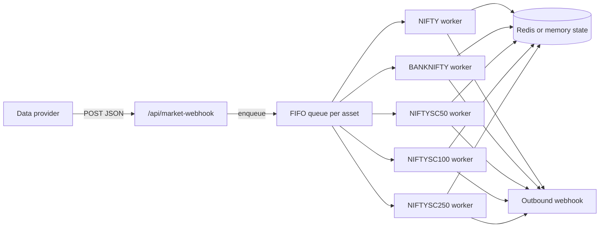

# Event-driven market webhook alerts

Incoming candle webhooks are processed as a **decoupled, ordered pipeline**: ingest → FIFO queue → single worker per index → stateful anomaly detection → optional outbound alert webhook.

## Architecture



- **Ingestion** returns `200` immediately after enqueue (no ATR math on the hot path).
- **One worker per asset** (`NIFTY`, `BANKNIFTY`, `NIFTYSC50`, `NIFTYSC100`, `NIFTYSC250`) guarantees chronological processing without cache locks.
- **State**: rolling OHLCV buffer (default 30 candles) + `lastProcessedTs` in Redis or in-process memory.
- **Queue**: Redis Streams per asset when `REDIS_URL` is set; otherwise `asyncio.Queue` per asset.

## Inbound payload

```json
{
  "timestamp": 1717334400000,
  "ticker": "NIFTY 50",
  "open": 24050,
  "high": 24180,
  "low": 24040,
  "close": 24170,
  "volume": 500000
}
```

Supported tickers:

| Internal key | Accepts (examples) |
|--------------|-------------------|
| `NIFTY` | `NIFTY`, `NIFTY 50`, `NSE:NIFTY` |
| `BANKNIFTY` | `BANKNIFTY`, `NIFTY BANK`, `BANK NIFTY` |
| `NIFTYSC50` | `NIFTY SMALLCAP 50`, `NIFTYSC50` |
| `NIFTYSC100` | `NIFTY SMALLCAP 100`, `NIFTYSC100` |
| `NIFTYSC250` | `NIFTY SMALLCAP 250`, `NIFTYSC250` |

Smallcap indices are **index-only** (no NSE F&O chain). Outbound alerts still use ATM-style strike rounding for direction; `metadata.indexOnly` is `true` on those payloads.

## Detection logic

| Phase | Behavior |
|-------|----------|
| Validate | Supported ticker; timestamp newer than last processed; not stale (`ALERT_MAX_STALE_MS`) |
| Baselines | 14-period ATR, 20-period volume SMA on updated buffer |
| Gate A | `(high - low) > ALERT_PRICE_RANGE_ATR_MULT × ATR` (default 2×) |
| Gate B | `volume > ALERT_VOLUME_SMA_MULT × volume SMA` (default 2.5×) |
| Direction | Close > open → ATM **CE**; else ATM **PE** |
| Stop | Bullish: candle **low**; bearish: candle **high** |

## Outbound alert JSON

Posted to `ALERT_OUTBOUND_WEBHOOK_URL` when gates pass:

```json
{
  "ticker": "NIFTY",
  "action": "Buy 24150 CE",
  "strikePrice": 24150,
  "entryPrice": 24170,
  "stopLoss": 24040,
  "direction": "bullish",
  "timestamp": 1717334400000,
  "anomalyRange": 140,
  "atrBaseline": 42.5,
  "volumeBaseline": 120000
}
```

If `ALERT_OUTBOUND_WEBHOOK_URL` is unset, alerts are logged only (dry-run).

## Environment

| Variable | Default | Purpose |
|----------|---------|---------|
| `REDIS_URL` | — | Redis for streams + state; omit for dev in-memory mode |
| `MARKET_WEBHOOK_SECRET` | — | Require `X-Market-Webhook-Secret` on ingest |
| `ALERT_OUTBOUND_WEBHOOK_URL` | — | Telegram/Slack/execution webhook |
| `ALERT_WEBHOOK_SECRET` | — | Sent as `X-Alert-Secret` on outbound POST |
| `ALERT_PRICE_RANGE_ATR_MULT` | `2.0` | Gate A multiplier |
| `ALERT_VOLUME_SMA_MULT` | `2.5` | Gate B multiplier |
| `ALERT_BUFFER_MAX_CANDLES` | `30` | Rolling buffer size |
| `ALERT_MAX_STALE_MS` | `300000` | Reject delayed ticks |

## Endpoints

- `POST /api/market-webhook` — ingest
- `GET /api/alert-pipeline/status` — queue/state backend and worker stats
- `GET /health` — includes `alertPipeline` summary

## Client library

TypeScript helpers in `src/lib/candleAnomaly.ts` mirror server gates for unit tests and tooling.

## Production notes

- Use **Redis Streams** (`REDIS_URL`) so bursts survive process restarts and ingest stays sub-10ms.
- Run a **single worker consumer per index** (already enforced in this repo).
- Warm the buffer with ~25 normal candles before expecting alerts.
- Optional FastAPI-only ingest can sit in front of this endpoint as a thin proxy; the Python proxy uses aiohttp on the same port for one deployment unit.
